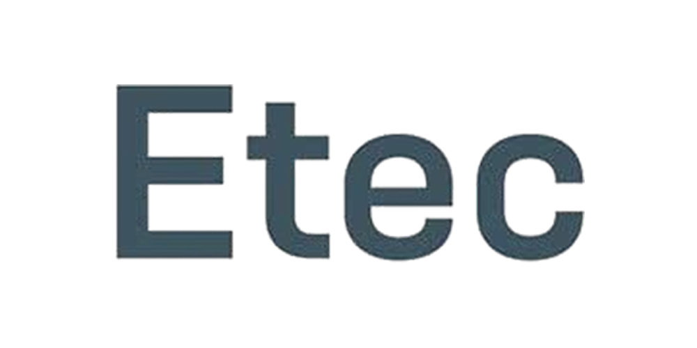

# 🖱 Programação Web II

## 📰 Descrição

Conceitos básicos desenvolvidos durante as aulas de Programação Web II, lecionadas pelos professores João e Luis

## 💻 Tecnologias Utilizadas
`Trabalhado durante as aulas:`

 
          

## 🙋 Autores
[    Gabriel Possato ](https://github.com/possatogabriel)
 
 

     

